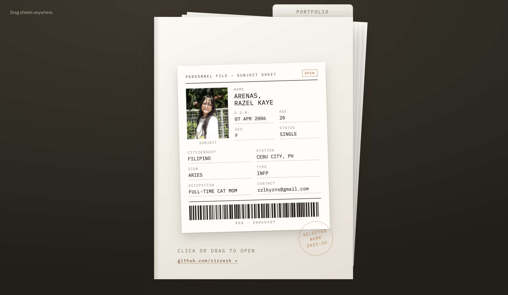
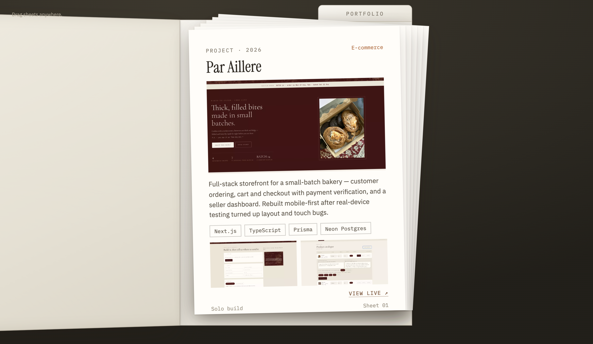
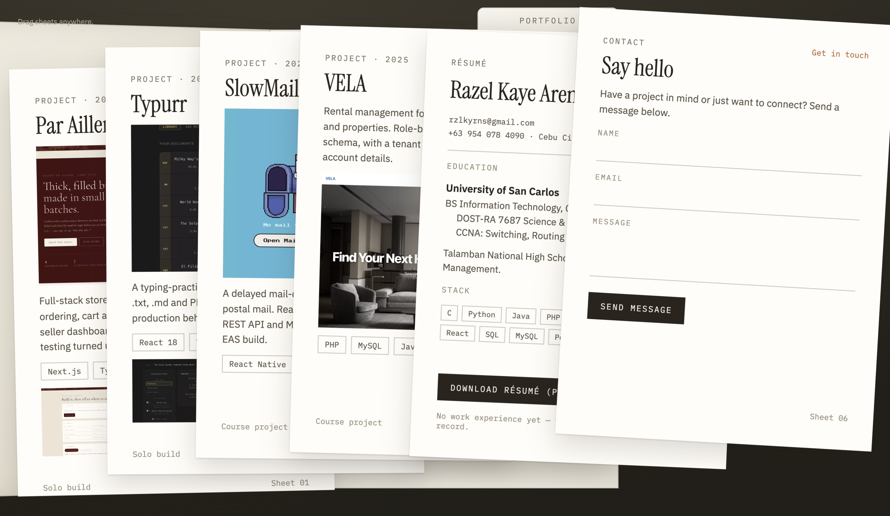

# Razel Kaye Arenas — Portfolio

An interactive, drag-and-drop personal portfolio. The whole site is a folder on a desk: click the "Portfolio" tab or drag the cover to open it, then drag the sheets inside around freely. Each sheet is a project card, a résumé, or a contact form.

## Technologies used

- HTML5 / CSS3 (no framework — everything is a single static page)
- Vanilla JavaScript (`js/folder-portfolio.js`) for the drag physics, folder open/close animation, and contact form handling
- Google Fonts — Instrument Serif, IBM Plex Mono, IBM Plex Sans
- WebP images with lazy loading and a loading-spinner fallback

## Setup instructions (GitHub Pages deployment)

No build step or dependencies — it's a static site, so Pages can serve it as-is.

1. Push this repo to GitHub.
2. On GitHub, go to **Settings → Pages**.
3. Under **Build and deployment → Source**, choose **Deploy from a branch**.
4. Under **Branch**, select `main` and folder `/ (root)`, then **Save**.
5. Wait a minute for the first build, then the live URL will appear at the top of the Pages settings page (and below, once set).

To use a custom domain instead, add it in the same Pages settings page and create a `CNAME` file at the repo root with the domain name.

## Live site

Deployed via GitHub Pages: `https://rizzerk.github.io/razelkaye/`.

## Screenshots

